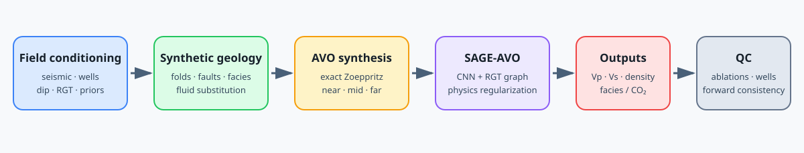

# SAGE-AVO

**Structure-aware, physics-regularized refinement of low-frequency elastic priors from three-band AVO data.**

[](https://github.com/scifiss/SAGE-AVO/actions/workflows/ci.yml)
[](LICENSE)

SAGE-AVO combines field-conditioned stratigraphic structure, exact-Zoeppritz
synthetic training data, RGT-guided graph attention, deterministic conditional
residual transport, and differentiable seismic-consistency constraints.



## Release scope

Version 0.1 provides the complete five-stage research workflow: field structure
and elastic-background construction, field-conditioned geological realization
generation, exact-physics AVO synthesis, leakage-safe ML dataset construction,
controlled SAGE-AVO training, and evaluation/field-deployment orchestration.
Field inputs and generated field artifacts remain private. Trained SAGE-AVO
checkpoints and controlled benchmark results are outside this release.

### Stage 01 structure-model contract

Notebook 01 is the complete field structure and elastic-background stage. From
the configured SEG-Y, T6/T7 interpretations, and five LAS wells it performs:

1. validated near/mid/far stacking and structure-stack construction;
2. PWD dip estimation, structure-oriented smoothing, RGT integration, and
   explicit monotonicity repair;
3. horizon projection, well-based depth-to-time conversion, well ties, and
   seismic-conformed modeling-horizon calibration;
4. Wheeler/RGT regional property interpolation and T6--T7 local-stratigraphic
   reservoir conditioning with support confidence;
5. grouped regional and reservoir Random-Forest Vp/Vs/density modeling with
   leave-one-well-out QC;
6. canonical arrays, model files, tables, checksums, QC records, and manifests
   under the versioned `s01data/v003` contract. Raw, monotonic-repaired, and
   optional horizon-refined RGT are retained as distinct artifacts.

Downstream stages consume this exported contract through `data/`; reusable
algorithms reside in `src/sage_avo`.

## Why AVO inversion is difficult

Prestack elastic inversion is ill posed: multiple Vp/Vs/density combinations
can produce similar band-limited amplitudes. Real gathers add noise, uncertain
wavelets, nonlinear angle response, processing footprints, sparse well control,
and reflectors that are not aligned on a Cartesian grid. A network that ignores
these facts can learn a visually plausible synthetic mapping without remaining
geologically or seismically credible on field data.

SAGE-AVO estimates residual elastic detail conditioned on a supplied
low-frequency prior, three-band AVO, and stratigraphic structure.

## Method components

- **Structure:** plane-wave-destruction dip and relative geologic time provide a
  stratigraphic coordinate. Dynamic graph edges connect adjacent traces at the
  closest RGT rather than simply at the same time sample.
- **Physics:** exact P-P Zoeppritz modeling generates synthetic data. A matched,
  differentiable Torch operator regularizes predicted elastic properties.
- **Learning:** a CNN extracts local context; TransformerConv graph attention
  propagates along structure; a deterministic straight-path conditional flow
  refines Vp, Vs, and density and optionally segments facies/CO₂.

The current flow starts from the supplied prior and has no stochastic latent
state. It is conditional residual transport, not a calibrated probabilistic
posterior.

## Architecture

```text
low-frequency Vp/Vs/rho ─┐
                         ├─ CNN encoder ─┐
near/mid/far AVO ────────┘               │
      │                                  ├─ fused decoder ─ elastic velocity field
      └─ P / G / curvature ─ RGT graph ──┤
RGT ───────────────────── TransformerConv └─ facies/CO₂ segmentation

loss = flow + full-property + segmentation + Zoeppritz consistency + graph smoothness
```

“Transformer” refers specifically to TransformerConv graph attention in the RGT
graph branch.

## Controlled benchmark design

**SAGE-AVO refines supplied low-frequency elastic priors rather than estimating
absolute elastic properties from AVO alone.** The synthetic prior is explicitly
constructed by Gaussian-filtering Vp, Vs, and density truth at a nominal 2 Hz
cutoff. It is therefore an oracle prior used to quantify incremental refinement.

The versioned experiment runner defines five conditions under identical data
and evaluation settings:

1. low-frequency prior only;
2. full SAGE-AVO;
3. no GNN;
4. Cartesian graph without RGT steering;
5. full architecture without the physics loss.

The protocol and commands are documented in
[docs/controlled_benchmark.md](docs/controlled_benchmark.md). Controlled metrics
are generated by the experiment runner and are outside the version-0.1 release.

## Repository structure

```text
configs/                 portable experiment and local-path templates
notebooks/               complete five-stage research workflow
src/sage_avo/data/       splits, normalization, multiscale patch metadata
src/sage_avo/structure/  RGT, horizon, and graph utilities
src/sage_avo/geology/    facies convention, perturbation, fluid substitution
src/sage_avo/forward/    exact Zoeppritz, Shuey features, wavelet, stacks, QC
src/sage_avo/models/     SAGE-AVO and its controlled graph/physics variants
src/sage_avo/training/   flow path, losses, checkpoint handling
src/sage_avo/evaluation/ elastic/segmentation metrics and sensitivity
src/sage_avo/visualization/ publication figure builders
scripts/                 smoke test, forward QC, and figure entry points
tests/                   CPU-only tests independent of private data
docs/                    methodology, reproducibility, limitations, figures
```

## Quickstart

Clone the repository and enter the project directory:

```bash
git clone https://github.com/scifiss/SAGE-AVO.git
cd SAGE-AVO
```

Install the dependency-light scientific core:

```bash
python -m venv .venv
source .venv/bin/activate
python -m pip install --upgrade pip
python -m pip install -e .
python scripts/smoke_test.py
pytest
```

Install the field-notebook and neural-model dependencies:

```bash
python -m pip install -e ".[ml,notebooks]"
jupyter lab
```

PyTorch/PyG can run small examples on CPU; full training is designed for a CUDA
GPU. Madagascar is optional and is not required by CI or the public smoke test.

Before committing or publishing changes, run the same checks used by CI:

```bash
ruff check src tests scripts
pytest
python scripts/smoke_test.py
python scripts/check_public_repo.py
```

The final command rejects likely private paths, secrets, and unexpectedly large
files. It complements `.gitignore`; it does not replace a manual review of
`git status` and the staged diff.

## Notebooks

The notebooks form one versioned scientific pipeline:

1. `01_structure_model.ipynb` — field stacking, PWD/RGT, horizons/wells,
   field-conditioned properties, elastic background, QC, and export;
2. `02_synthetic_avo_generation.ipynb` — coherent geological deformation,
   facies/porosity perturbation, CO₂ fluid substitution, exact dense-angle
   Zoeppritz response, angle stacks, and realization manifests;
3. `03_ml_dataset_construction.ipynb` — realization-level splits, disclosed
   truth-derived low-frequency priors, train-only normalization, multiscale
   patches, and integrity checks;
4. `04_sage_avo_training.ipynb` — CNN/TransformerConv model, RGT graph,
   deterministic residual transport, complete objective, controlled variants,
   training, validation, and checkpoint selection;
5. `05_evaluation_and_field_application.ipynb` — per-realization controlled
   evaluation, graph mechanism, whole-image inference, field deployment/QC,
   well consistency, forward seismic QC, and sensitivity.

Execution uses authorized data configured through ignored `configs/paths.yaml`.
Reusable algorithms reside in `src/sage_avo`; public notebooks retain the
scientific orchestration, equations, parameters, data contracts, and QC logic.

## Data availability and privacy

Proprietary field SEG-Y, horizons, LAS logs, trained checkpoints, and derived
private artifacts are not distributed. Copy
`configs/paths.example.yaml` to `configs/paths.yaml` and fill in local paths.
The local file and common geoscience binaries are ignored by git.

Publicly reproducible components include the NumPy forward model, geological
perturbation, graph construction, metrics, tests, and smoke demo. Full dataset
generation and field deployment require authorized data. Madagascar-based
forward-model validation additionally requires a local Madagascar installation.

## Field deployment and QC

Field evaluation reports:

- whether each well contributed upstream to structure, rock physics, or priors;
- per-band forward scale, correlation, and normalized RMSE;
- checkpoint and prior-cutoff **model/prior sensitivity**;
- all masks, normalization parameters, checkpoints, and input manifests needed
  to reproduce the evaluation.

The field scope and validation boundaries are documented in
[docs/limitations.md](docs/limitations.md).

## Reproducibility and scientific scope

- Synthetic train/validation/test splits are made by complete realization.
- Normalization is fitted on training data only.
- Resized multiscale patches retain their raw scale metadata.
- Normalized DELTA is consistently `1 - P(sand)`.
- Production angle bands are 3–17°, 17–31°,
  and 31–45°. Shared endpoints at 17° and 31° are intentional; compact P/G
  coordinates are the band midpoints 10°, 24°, and 38°.
- Numerical SEG-Y header bins are checked against configuration. Their semantic
  interpretation as incidence angle still requires acquisition/export metadata;
  numerical validity alone is not semantic proof.
- Torch/Madagascar agreement is measured under matched assumptions when both
  forward implementations contribute to an experiment.

See [methodology](docs/methodology.md) and
[data/reproducibility](docs/data_and_reproducibility.md) for the full protocol.

### Versioned experiment drivers

The command-line drivers separate bounded operator validation from full
field-conditioned experiments. Validation runs are explicitly labeled and are
not eligible for performance claims. Production runs require versioned source,
data, and calibration manifests, write only to the configured artifact root,
and require an explicit `--resume` flag before continuing an existing training
run. Each driver exposes its available stages and safeguards through `--help`.

## Citation

The software citation identifies the repository version used in an experiment:

```bibtex
@software{sage_avo_2026,
  title = {SAGE-AVO: Structure-Aware, Physics-Regularized Elastic-Prior Refinement},
  year = {2026},
  version = {0.1.0},
  url = {https://github.com/scifiss/SAGE-AVO}
}
```

## License

Code is released under the [BSD 3-Clause License](LICENSE). Data and third-party
software retain their own terms and are not relicensed by this repository.
